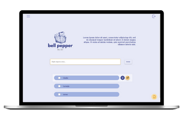

# <a href="https://darllen.github.io/bellpepper/" target="_blank">👉 Bell Pepper</a>

# 💻 Sobre o projeto

Página de Checklist

# Comandos de configuração

cd database (Entrar na pasta database)

npm install (Instalar dependências)

nodemon server // npx nodemon server(Caso o primeiro comando não funcione)

## Layout

# 🚀 **Techs**

- HTML
- CSS
- JS

